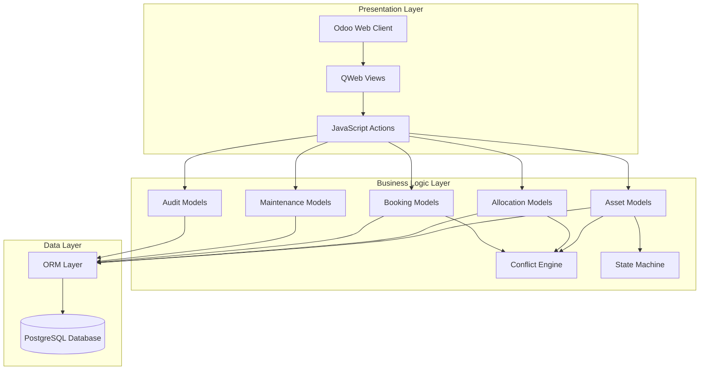
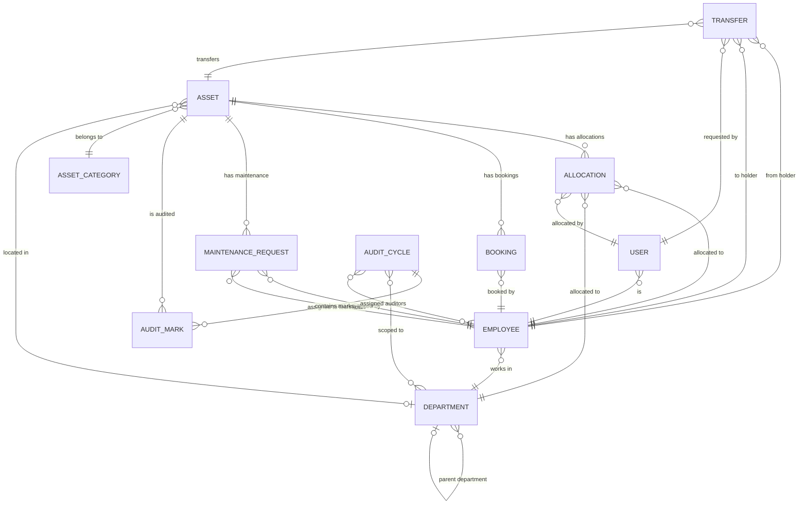

# Design Document: AssetFlow ERP

## Overview

AssetFlow is an Enterprise Asset & Resource Management System built as a custom Odoo module. The system provides comprehensive asset lifecycle management, resource booking with conflict detection, maintenance workflows, audit cycles, and role-based access control. This design leverages [Odoo's modular architecture and MVC pattern](https://www.odoo.com/documentation/17.0/th/developer/tutorials/server_framework_101/01_architecture.html) to create a maintainable, extensible solution.

### Key Design Goals

1. **State Machine Integrity**: Enforce valid asset lifecycle transitions at the model layer using Odoo's constraint system
2. **Conflict-First Design**: Detect and guide resolution of allocation and booking conflicts through a dedicated Conflict Engine
3. **Role-Based Progressive Disclosure**: Use Odoo's security groups and record rules to progressively expose functionality based on user role
4. **Audit Trail Completeness**: Log every state-changing action using automated activity tracking
5. **Performance at Scale**: Use computed stored fields, database indexes, and efficient queries for large asset inventories

### Technology Stack

- **Platform**: Odoo 17 Community Edition
- **Language**: Python 3.10+
- **Framework Pattern**: Model-View-Controller (MVC)
- **Database**: PostgreSQL 14+
- **Frontend**: Odoo Web Client (OWL JavaScript framework, QWeb templates)
- **Authentication**: Odoo's built-in authentication system with session management

---

## Architecture

### High-Level Architecture

AssetFlow follows Odoo's three-tier architecture:



### Module Structure

Following [Odoo's coding guidelines](https://www.odoo.com/documentation/17.0/contributing/development/coding_guidelines.html), the module is organized as:

```
assetflow_erp/
├── __init__.py
├── __manifest__.py
├── security/
│   ├── ir.model.access.csv
│   └── security.xml (groups, record rules)
├── models/
│   ├── __init__.py
│   ├── asset.py (asset.asset)
│   ├── asset_category.py (asset.category)
│   ├── asset_allocation.py (asset.allocation)
│   ├── asset_booking.py (asset.booking)
│   ├── asset_transfer.py (asset.transfer)
│   ├── maintenance_request.py (maintenance.request)
│   ├── audit_cycle.py (audit.cycle)
│   ├── audit_mark.py (audit.mark)
│   ├── department.py (hr.department - inherited)
│   ├── employee.py (hr.employee - inherited)
│   └── res_users.py (res.users - inherited)
├── views/
│   ├── asset_views.xml
│   ├── allocation_views.xml
│   ├── booking_views.xml
│   ├── maintenance_views.xml
│   ├── audit_views.xml
│   ├── department_views.xml
│   ├── kpi_dashboard.xml
│   └── menu.xml
├── wizards/
│   ├── __init__.py
│   ├── conflict_resolver.py
│   └── discrepancy_report.py
├── reports/
│   ├── __init__.py
│   ├── utilization_report.py
│   ├── maintenance_report.py
│   └── booking_heatmap.py
└── data/
    └── asset_sequence.xml
```

### Security Architecture

AssetFlow uses Odoo's [three-layer security model](https://www.odoo.com/documentation/18.0/developer/reference/backend/security.html):

1. **Groups (Roles)**: Define user roles (Employee, Department_Head, Asset_Manager, Admin)
2. **Access Rights**: Model-level CRUD permissions per group
3. **Record Rules**: Record-level visibility filters using domain expressions

**Security Groups Hierarchy**:
```
assetflow.group_admin (Admin)
  ├─ assetflow.group_asset_manager (Asset Manager)
  │    └─ assetflow.group_department_head (Department Head)
  │         └─ assetflow.group_employee (Employee - base.group_user)
```

---

## Components and Interfaces

### Core Models

#### 1. Asset Model (`asset.asset`)

**Purpose**: Central model representing physical assets with lifecycle state management.

**Key Fields**:
- `name`: Char(150) - Asset name
- `asset_tag`: Char(10), readonly, auto-generated - Unique identifier (AF-XXXX)
- `serial_number`: Char(100), unique - Serial number
- `category_id`: Many2one('asset.category') - Asset category
- `state`: Selection - Lifecycle state (Available, Allocated, Reserved, Under_Maintenance, Lost, Retired, Disposed)
- `condition`: Selection - Physical condition (Good, Fair, Poor, Damaged)
- `acquisition_date`: Date - Purchase date
- `acquisition_cost`: Float - Purchase cost
- `location`: Char(200) - Physical location
- `department_id`: Many2one('hr.department') - Assigned department
- `current_holder_id`: Many2one('hr.employee'), computed - Current employee holder
- `is_bookable`: Boolean - Whether asset supports time-slot booking
- `attachment_ids`: One2many('ir.attachment') - Photos and documents

**Key Methods**:
- `create()`: Override to auto-generate asset_tag from sequence
- `_check_state_transition(new_state)`: Validate state machine transitions
- `action_allocate()`: Transition to Allocated state with validation
- `action_return()`: Transition back to Available on return
- `action_reserve()`: Transition to Reserved for bookings
- `action_maintain()`: Transition to Under_Maintenance
- `action_mark_lost()`: Transition to Lost
- `action_retire()`: Transition to Retired
- `action_dispose()`: Transition to Disposed (terminal state)

**Constraints**:
- SQL: `UNIQUE(asset_tag)`, `UNIQUE(serial_number)`
- Python: `@api.constrains('state')` - Validate state transitions using state machine graph

**State Machine Graph**:
```python
VALID_TRANSITIONS = {
    'available': ['allocated', 'reserved', 'under_maintenance', 'lost', 'retired'],
    'allocated': ['available', 'under_maintenance', 'lost'],
    'reserved': ['allocated', 'available'],
    'under_maintenance': ['available', 'retired'],
    'lost': ['available', 'disposed'],
    'retired': ['disposed'],
    'disposed': []  # Terminal state
}
```

#### 2. Asset Allocation Model (`asset.allocation`)

**Purpose**: Track assignment of assets to employees or departments.

**Key Fields**:
- `asset_id`: Many2one('asset.asset'), required - Allocated asset
- `holder_type`: Selection - 'employee' or 'department'
- `employee_id`: Many2one('hr.employee') - Employee holder (if holder_type='employee')
- `department_id`: Many2one('hr.department') - Department holder (if holder_type='department')
- `allocated_by_id`: Many2one('res.users'), default=current user - Asset manager who allocated
- `allocation_date`: Datetime, default=now - When allocated
- `expected_return_date`: Date, optional - Expected return date
- `actual_return_date`: Datetime - When actually returned
- `return_condition`: Selection - Condition on return
- `status`: Selection - 'active', 'overdue', 'closed'
- `is_overdue`: Boolean, computed, stored - Whether past expected return date

**Key Methods**:
- `create()`: Override to validate asset is Available, trigger state transition to Allocated
- `action_return(return_condition)`: Mark as closed, transition asset back to Available
- `_check_overdue()`: Scheduled action runs daily to flag overdue allocations
- `_compute_is_overdue()`: Computed field checking if expected_return_date < today

**Constraints**:
- Python: `@api.constrains('asset_id')` - Ensure asset is Available before allocation
- Python: `@api.constrains('expected_return_date')` - Must be future date if provided

#### 3. Asset Booking Model (`asset.booking`)

**Purpose**: Time-slot reservations for shared/bookable assets.

**Key Fields**:
- `asset_id`: Many2one('asset.asset'), required, domain=[('is_bookable', '=', True)]
- `booker_id`: Many2one('hr.employee'), default=current user's employee
- `start_time`: Datetime, required
- `end_time`: Datetime, required
- `purpose`: Text - Booking purpose/description
- `status`: Selection - 'upcoming', 'ongoing', 'completed', 'cancelled'
- `duration_minutes`: Integer, computed - Duration in minutes
- `reminder_sent`: Boolean - Whether reminder notification sent

**Key Methods**:
- `create()`: Override to validate no overlapping bookings, set status='upcoming', reserve asset
- `write()`: Override to validate overlap on reschedule
- `_check_overlap(asset_id, start_time, end_time, exclude_id=None)`: Returns overlapping booking or False
- `_transition_bookings()`: Scheduled action runs every 5 minutes to transition upcoming→ongoing→completed based on time
- `action_cancel()`: Set status='cancelled', release asset reservation
- `_send_reminders()`: Scheduled action runs every 15 minutes to send reminders 30min before start

**Overlap Detection Algorithm**:
```python
def _check_overlap(self, asset_id, start_time, end_time, exclude_id=None):
    """
    Two intervals [start1, end1) and [start2, end2) overlap if:
    start1 < end2 AND end1 > start2
    """
    domain = [
        ('asset_id', '=', asset_id),
        ('status', 'in', ['upcoming', 'ongoing']),
        ('start_time', '<', end_time),
        ('end_time', '>', start_time),
    ]
    if exclude_id:
        domain.append(('id', '!=', exclude_id))
    return self.search(domain, limit=1)
```

**Constraints**:
- Python: `@api.constrains('start_time', 'end_time')` - end_time > start_time, duration >= 15 minutes, start_time must be future
- Python: `@api.constrains('asset_id')` - Asset must have is_bookable=True

#### 4. Transfer Request Model (`asset.transfer`)

**Purpose**: Formal workflow for transferring allocated assets between holders.

**Key Fields**:
- `asset_id`: Many2one('asset.asset')
- `current_holder_id`: Many2one('hr.employee')
- `requested_holder_id`: Many2one('hr.employee')
- `requester_id`: Many2one('res.users'), default=current user
- `reason`: Text(1-500 chars)
- `status`: Selection - 'requested', 'approved', 're-allocated', 'rejected'
- `request_date`: Datetime, default=now
- `reviewed_by_id`: Many2one('res.users')
- `review_date`: Datetime
- `rejection_reason`: Text

**Key Methods**:
- `create()`: Validate current_holder matches asset's current holder, requester != requested_holder
- `action_approve()`: Check user is not requester, close old allocation, create new allocation, transition to 're-allocated'
- `action_reject(reason)`: Set status='rejected', notify requester

**Constraints**:
- Python: `@api.constrains('requester_id', 'reviewed_by_id')` - Prevent self-approval

#### 5. Maintenance Request Model (`maintenance.request`)

**Purpose**: Track maintenance workflow for assets.

**Key Fields**:
- `asset_id`: Many2one('asset.asset')
- `requester_id`: Many2one('hr.employee'), default=current user's employee
- `issue_description`: Text(10-2000 chars)
- `priority`: Selection - 'low', 'medium', 'high', 'critical'
- `status`: Selection - 'pending', 'approved', 'technician_assigned', 'in_progress', 'resolved', 'rejected'
- `technician_id`: Many2one('hr.employee')
- `resolution_notes`: Text(min 10 chars)
- `request_date`: Datetime, default=now
- `resolution_date`: Datetime
- `attachment_ids`: One2many('ir.attachment')

**Key Methods**:
- `create()`: Set status='pending', validate no open request exists for asset
- `action_approve()`: Set status='approved', transition asset to Under_Maintenance
- `action_reject(reason)`: Set status='rejected', notify requester
- `action_assign_technician(technician_id)`: Set status='technician_assigned'
- `action_start()`: Set status='in_progress'
- `action_resolve(resolution_notes)`: Set status='resolved', transition asset back to Available

**Constraints**:
- Python: `@api.constrains('asset_id')` - Check no open maintenance request exists
- Python: `@api.constrains('resolution_notes')` - Required and min 10 chars when status='resolved'

#### 6. Audit Cycle Model (`audit.cycle`)

**Purpose**: Coordinate physical verification of assets.

**Key Fields**:
- `name`: Char - Audit cycle name
- `scope_type`: Selection - 'department', 'location', 'all'
- `department_ids`: Many2many('hr.department') - Scope departments
- `location`: Char - Scope location
- `start_date`: Date
- `end_date`: Date
- `auditor_ids`: Many2many('hr.employee')
- `status`: Selection - 'open', 'closed'
- `audit_mark_ids`: One2many('audit.mark')
- `discrepancy_report`: Text, readonly - Auto-generated on close

**Key Methods**:
- `create()`: Set status='open'
- `action_close()`: Generate discrepancy report, update asset states, set status='closed', lock cycle
- `_generate_discrepancy_report()`: Generate report listing Missing, Damaged, Unverified assets
- `_get_in_scope_assets()`: Return recordset of assets matching scope

#### 7. Audit Mark Model (`audit.mark`)

**Purpose**: Record individual asset verification within audit cycle.

**Key Fields**:
- `cycle_id`: Many2one('audit.cycle')
- `asset_id`: Many2one('asset.asset')
- `auditor_id`: Many2one('hr.employee'), default=current user's employee
- `mark`: Selection - 'verified', 'missing', 'damaged'
- `mark_date`: Datetime, default=now
- `notes`: Text

**Key Methods**:
- `create()`: Validate asset is in cycle scope, cycle is 'open'

**Constraints**:
- Python: `@api.constrains('cycle_id')` - Cycle must be 'open'
- Python: `@api.constrains('asset_id', 'cycle_id')` - Asset must be in scope

#### 8. Asset Category Model (`asset.category`)

**Purpose**: Categorize assets with optional custom fields.

**Key Fields**:
- `name`: Char(1-100), unique
- `active`: Boolean, default=True
- `custom_field_ids`: One2many('asset.category.field') - Category-specific fields
- `maintenance_interval_days`: Integer - Default maintenance interval
- `useful_life_years`: Integer - Expected useful life

**Constraints**:
- SQL: `UNIQUE(name)`
- Python: `@api.constrains('custom_field_ids')` - Max 20 custom fields per category

### Conflict Engine

**Purpose**: Detect conflicts and guide users toward resolution rather than simply blocking actions.

**Implementation**: Wizard model `conflict.resolver` that presents conflict details and resolution options.

**Key Methods**:

```python
class ConflictResolver(models.TransientModel):
    _name = 'conflict.resolver'
    
    conflict_type = fields.Selection([('allocation', 'Allocation'), ('booking', 'Booking')])
    asset_id = fields.Many2one('asset.asset')
    current_holder_id = fields.Many2one('hr.employee')
    conflicting_booking_id = fields.Many2one('asset.booking')
    suggested_slot_start = fields.Datetime()
    suggested_slot_end = fields.Datetime()
    resolution_action = fields.Selection([
        ('request_transfer', 'Request Transfer'),
        ('choose_different_asset', 'Choose Different Asset'),
        ('select_suggested_slot', 'Select Suggested Slot')
    ])
    
    def check_allocation_conflict(self, asset_id):
        """Check if asset is available for allocation"""
        asset = self.env['asset.asset'].browse(asset_id)
        if asset.state != 'available':
            return self._present_allocation_conflict(asset)
        return False
    
    def check_booking_conflict(self, asset_id, start_time, end_time):
        """Check for overlapping bookings"""
        overlap = self.env['asset.booking']._check_overlap(asset_id, start_time, end_time)
        if overlap:
            suggested = self._find_next_available_slot(asset_id, start_time, 7)
            return self._present_booking_conflict(overlap, suggested)
        return False
    
    def _find_next_available_slot(self, asset_id, preferred_start, days_window):
        """Find next available time slot within days_window"""
        # Implementation: iterate through time slots, check overlap
        pass
    
    def action_resolve(self):
        """Execute selected resolution action"""
        if self.resolution_action == 'request_transfer':
            # Pre-populate transfer request form
            pass
        elif self.resolution_action == 'select_suggested_slot':
            # Pre-populate booking form with suggested slot
            pass
```

### KPI Dashboard Service

**Purpose**: Real-time aggregation of asset metrics for dashboard display.

**Implementation**: Computed fields on a transient model refreshed on page load.

```python
class KpiDashboard(models.TransientModel):
    _name = 'kpi.dashboard'
    
    assets_available = fields.Integer(compute='_compute_kpis')
    assets_allocated = fields.Integer(compute='_compute_kpis')
    maintenance_today = fields.Integer(compute='_compute_kpis')
    active_bookings = fields.Integer(compute='_compute_kpis')
    pending_transfers = fields.Integer(compute='_compute_kpis')
    upcoming_returns = fields.Integer(compute='_compute_kpis')
    overdue_returns = fields.Integer(compute='_compute_kpis')
    
    def _compute_kpis(self):
        """Compute KPI values with role-based filtering"""
        user = self.env.user
        domain = self._get_role_based_domain(user)
        
        # Efficient single-query aggregation where possible
        self.assets_available = self.env['asset.asset'].search_count(
            domain + [('state', '=', 'available')]
        )
        # ... similar for other KPIs
```

---

## Data Models

### Entity-Relationship Diagram



### Key Relationships

1. **Asset → Allocation**: One-to-Many (an asset can have multiple allocation records over time)
2. **Asset → Booking**: One-to-Many (a bookable asset can have multiple bookings)
3. **Asset → Category**: Many-to-One (many assets belong to one category)
4. **Allocation → Employee**: Many-to-One (many allocations can be to same employee)
5. **Transfer → Asset**: Many-to-One (many transfer requests for same asset)
6. **Audit_Cycle → Audit_Mark**: One-to-Many (one cycle contains many marks)
7. **Department → Department**: Self-referential (parent-child hierarchy, max 5 levels)

### Database Indexes

For performance on large datasets, create indexes on:

```sql
-- Asset searches
CREATE INDEX idx_asset_state ON asset_asset(state);
CREATE INDEX idx_asset_category ON asset_asset(category_id);
CREATE INDEX idx_asset_department ON asset_asset(department_id);
CREATE INDEX idx_asset_tag ON asset_asset(asset_tag);
CREATE INDEX idx_serial_number ON asset_asset(serial_number);

-- Allocation queries
CREATE INDEX idx_allocation_employee ON asset_allocation(employee_id) WHERE employee_id IS NOT NULL;
CREATE INDEX idx_allocation_department ON asset_allocation(department_id) WHERE department_id IS NOT NULL;
CREATE INDEX idx_allocation_status ON asset_allocation(status);
CREATE INDEX idx_allocation_overdue ON asset_allocation(expected_return_date) WHERE status = 'active';

-- Booking overlap checks
CREATE INDEX idx_booking_asset_time ON asset_booking(asset_id, start_time, end_time) WHERE status IN ('upcoming', 'ongoing');

-- Activity log queries
CREATE INDEX idx_activity_log_timestamp ON mail_message(date) WHERE model IN ('asset.asset', 'asset.allocation', ...);
```

---

## Correctness Properties

*A property is a characteristic or behavior that should hold true across all valid executions of a system—essentially, a formal statement about what the system should do. Properties serve as the bridge between human-readable specifications and machine-verifiable correctness guarantees.*

Before defining correctness properties, I need to analyze the acceptance criteria to determine which are suitable for property-based testing.

